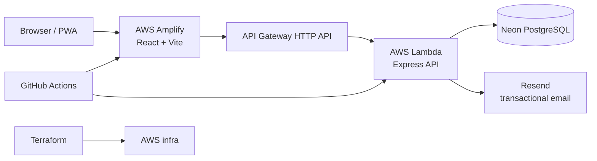

# PitchPulse 26

PitchPulse 26 is a full-stack World Cup prediction platform that allowed football fans to predict match scores, earn points, follow standings, and compete on a live leaderboard from the group stage through the Final.

The World Cup 2026 tournament is complete. The application remains available as a **read-only tournament archive** and production case study.

| | |
|---|---|
| **Live application** | [https://pitchpulse26.com](https://pitchpulse26.com) |
| **GitHub repository** | [github.com/gerardinhoo/PitchPulse26](https://github.com/gerardinhoo/PitchPulse26) |
| **Tournament statistics** | [https://pitchpulse26.com/statistics](https://pitchpulse26.com/statistics) |
| **Final standings** | [https://pitchpulse26.com/leaderboard](https://pitchpulse26.com/leaderboard) |
| **Match archive** | [https://pitchpulse26.com/matches](https://pitchpulse26.com/matches) |

> Free to play. No betting. No gambling.

---

## 1. Project Overview

PitchPulse 26 was designed, built, deployed, and operated as a live product during FIFA World Cup 2026. Fans registered, verified their email, predicted scores before kickoff, and climbed a cumulative leaderboard as results were posted.

After the Final, the product transitioned into an archive: historical fixtures, predictions, and standings remain available; new predictions are closed; scheduled match reminders are disabled; admin historical result correction remains available.

This repository documents both the software and the operational journey — including production incidents, incremental knockout-stage expansion, and post-tournament cleanup.

**Case-study docs:** see [docs/README.md](docs/README.md).

---

## 2. Problem Solved

Casual World Cup prediction groups usually live in spreadsheets, group chats, or one-off forms that break once knockout rounds begin.

PitchPulse 26 provided:

- A shared, authenticated place to submit and update predictions before kickoff
- Transparent scoring (exact score vs correct result)
- Live group standings and a tournament-wide leaderboard
- Stage-by-stage fixture coverage as the real World Cup progressed
- A durable public record after the tournament ended

---

## 3. Tournament Results

### Final tournament snapshot

Snapshot sourced from production `GET /api/statistics/tournament` and `GET /api/leaderboard` on **2026-07-30**. Re-verify against the live [Statistics](https://pitchpulse26.com/statistics) and [Leaderboard](https://pitchpulse26.com/leaderboard) pages if historical results are corrected later.

| Result | Value |
|--------|-------|
| World Cup champion | Spain |
| World Cup Final | Spain 1–0 Argentina |
| PitchPulse 26 champion | Jimbo (84 pts) |
| Runner-up | MaluY (77 pts) |
| Third place | Den (67 pts) |
| Registered players (non-admin) | 22 |
| Active predictors | 11 |
| Total predictions | 638 |
| Tournament fixtures | 104 (all completed) |
| Tournament stages supported | 7 (Group Stage → Final) |
| Overall prediction accuracy | 57.1% (exact + correct result ÷ scored) |

Champion prize (static product copy; not stored in the database): Cape Verde national team jersey selected by the winner.

---

## 4. Key Features

- Email/password auth with JWT, email verification, and password reset (Resend)
- Score predictions with one-per-user-per-match upsert and kickoff lock
- Cumulative leaderboard (group + knockout) with dense ranking and scope filters
- Dynamic group standings (MP / W / D / L / GF / GA / GD / Pts)
- Full knockout coverage: Round of 32 → Final via incremental fixture imports
- Admin result posting with audit logging
- Post-tournament archive UX (homepage, Matches, Rules) + public Statistics page
- PWA install support (soft-hidden by default after tournament completion)
- Structured request logging, `/api/health`, `/api/ready`, CloudWatch dashboard/alarms

---

## 5. Architecture



Details: [docs/architecture.md](docs/architecture.md).

---

## 6. Technology Stack

| Layer | Choices |
|-------|---------|
| Frontend | React, TypeScript, Vite, Tailwind CSS, React Router, PWA (`sw.js` + manifest) |
| Backend | Node.js 22, Express, Zod validation, JWT auth |
| Data | PostgreSQL (Neon), Prisma ORM (`@prisma/adapter-neon`) |
| Email | Resend (verification, password reset; historical match reminders) |
| Infra | AWS Lambda, API Gateway, Amplify, S3 artifacts, SSM, CloudWatch, Terraform |
| CI/CD | GitHub Actions (lint, test, build, Lambda deploy + health check) |

---

## 7. Prediction and Scoring Flow

| Outcome | Points |
|---------|--------|
| Exact score | 3 |
| Correct winner or draw (wrong scoreline) | 1 |
| Incorrect | 0 |

- Predictions locked after kickoff (API + UI).
- After the Final is complete, prediction **writes** return `403`; historical reads remain.
- Group-stage points carry into knockout; overall leaderboard is cumulative.

Flow diagram: [docs/architecture.md](docs/architecture.md#prediction-submission-and-scoring-flow).

---

## 8. Authentication and Email Verification

- Register → bcrypt password hash → optional verification email (Resend)
- `REQUIRE_EMAIL_VERIFICATION` gates prediction writes until verified
- Login issues JWT (Bearer); admin routes require `role === "admin"`
- Forgot/reset password uses time-limited tokens and Resend delivery

See [docs/security.md](docs/security.md).

---

## 9. Infrastructure and Deployment

- **Frontend:** AWS Amplify (connected to `main`)
- **Backend:** Lambda zip artifacts in S3 → `pitchpulse26-api`
- **Database:** Neon Postgres (production separate from local/staging)
- **IaC:** Terraform under `infra/`

**Important production lesson:** code deployment does **not** automatically guarantee database schema compatibility. Prisma migrations must be applied deliberately against the correct database.

---

## 10. CI/CD

Workflow: [`.github/workflows/deploy.yml`](.github/workflows/deploy.yml)

On PRs and pushes to `main`: frontend lint/test/build + backend tests.  
On push to `main`: package Lambda, upload S3 artifact, update function code, curl `/api/health`.

Match reminders workflow ([`.github/workflows/reminders.yml`](.github/workflows/reminders.yml)): **scheduled cron disabled** after tournament completion; `workflow_dispatch` retained for manual dry-runs.

---

## 11. Observability

- Structured JSON logs (`timestamp`, `level`, `event`, `requestId`, …)
- CloudWatch dashboard `pitchpulse26-prod-overview` + error/duration/5xx alarms
- `GET /api/health` — process liveness
- `GET /api/ready` — includes database connectivity check

See [docs/observability.md](docs/observability.md).

---

## 12. Security and Data Protection

JWT auth, Zod input validation, Helmet, rate-limited auth routes, admin role checks, prediction lock after kickoff, audit trail for admin score changes, secrets via env/SSM/GitHub secrets — not committed.

No betting or gambling features. See [docs/security.md](docs/security.md).

---

## 13. Production Challenges and Incidents

Knockout rollout exposed a schema/migration gap (`tournamentStage`), a Prisma P3005 baseline situation, a temporary revert to restore service, fixture import sequencing, email deliverability/spam labeling, and short prediction windows for early knockout matches.

Full write-ups: [docs/incident-history.md](docs/incident-history.md).

---

## 14. Engineering Decisions

ADR-style notes: [docs/engineering-decisions.md](docs/engineering-decisions.md)  
(examples: serverless + Neon, cumulative scoring, incremental imports, archive mode, preserving historical scripts).

---

## 15. Testing Strategy

- Backend: Vitest unit + integration (scoring, auth, tournament-complete write gate, statistics)
- Frontend: Vitest + Testing Library (pages, archive UX, Statistics, auth flows)
- Manual production QA checklist in [docs/testing.md](docs/testing.md)
- Optional Artillery baseline: [docs/performance/load-test-baseline.md](docs/performance/load-test-baseline.md)

---

## 16. Final Metrics

Prefer live data:

```bash
curl -s https://fqblsiujfj.execute-api.us-east-1.amazonaws.com/api/statistics/tournament | jq .
```

See §3 for the labeled final snapshot captured for this README.

---

## 17. Lessons Learned

1. **Schema and code ship separately** — always migrate the target database before relying on new columns/enums in production.
2. **Incremental delivery beats big-bang fixtures** — import each knockout round with dry-run + upsert.
3. **Operate what you build** — CloudWatch, health/ready checks, and a rollback runbook matter as much as features.
4. **Email deliverability is product-critical** — verification gating fails quietly if mail lands in spam.
5. **Preserve history** — archive UX + admin correction beat wiping a finished tournament.

---

## 18. Future Improvements

Ideas only (not implemented): automatic bracket advancement, better email deliverability, private leagues, multi-tournament support, automated result ingestion, stronger admin tooling, deeper analytics, load testing expansion, native push notifications.

---

## 19. Local Development

### Prerequisites

- Node.js 22 (see `server/.nvmrc`; Vite needs a current Node 20.19+/22.12+ for builds)
- npm
- A Neon (or other Postgres) database for local use — **never** point local tooling at production casually

### Server

```bash
cd server
nvm use
npm install
cp .env.example .env   # if present; otherwise create .env
```

```env
PORT=5050
JWT_SECRET="<your-jwt-secret>"
CORS_ORIGIN=http://localhost:5173
DATABASE_URL="<your-database-url>"
REQUIRE_EMAIL_VERIFICATION=true
EMAIL_FROM=no-reply@updates.pitchpulse26.com
RESEND_API_KEY="<your-resend-api-key>"
APP_URL=http://localhost:5173
```

```bash
npx prisma generate
npx prisma migrate deploy
npm run dev
```

API: `http://localhost:5050/api`

**Do not** run `prisma migrate reset`, destructive seeds, or fixture imports against the historical production database.

### Client

```bash
cd client
npm install
npm run dev
```

App: `http://localhost:5173` (uses `VITE_API_URL`, defaulting to `http://localhost:5050/api`).

### Tests and build

```bash
cd client && npm run lint && npm test && npm run build
cd server && JWT_SECRET=test-secret npm test
```

Docker Compose (frontend + backend against Neon from `server/.env`) is also supported: `docker compose up --build`.

---

## 20. Deployment Notes

1. Merge to `main` → CI runs checks → Lambda artifact deploy + health check.
2. Amplify rebuilds the frontend from `main`.
3. Apply Prisma migrations to the **correct** Neon database **before** relying on schema-dependent code.
4. Validate `/api/health`, `/api/ready`, key UI routes, and (if relevant) statistics/leaderboard.
5. Rollback: [docs/runbooks/deployment-rollback.md](docs/runbooks/deployment-rollback.md) and [docs/production-runbook.md](docs/production-runbook.md).

Code deployment does not automatically guarantee database schema compatibility.

---

## 21. Repository Structure

```
PitchPulse26/
├── client/                 # React + Vite frontend (PWA)
├── server/                 # Express API, Prisma, fixture scripts
│   └── prisma/ARCHIVE.md   # Historical import / reminder notes
├── infra/                  # Terraform (Lambda, API GW, Amplify, monitoring, SES identity remnants)
├── docs/                   # Case-study documentation (start here)
├── .github/workflows/      # CI/CD + reminders (manual dispatch)
└── USER_STORIES.md         # Historical product backlog
```

---

## 22. Screenshots

No committed screenshot assets yet. See [docs/screenshots/README.md](docs/screenshots/README.md) for the recommended capture list (homepage, archive, standings, statistics, admin, mobile).

---

## 23. Status

| Area | Status |
|------|--------|
| World Cup 2026 predictions | Closed (archive) |
| Historical data | Preserved |
| Public browse / statistics / standings | Available |
| Admin historical corrections | Available |
| Scheduled match reminders | Disabled (manual dispatch only) |
| Auth / verification / password reset | Active |

---

Built and operated by Gerard Eklu.
