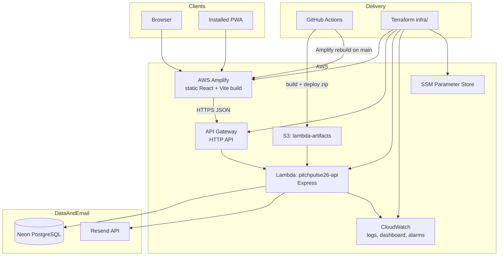
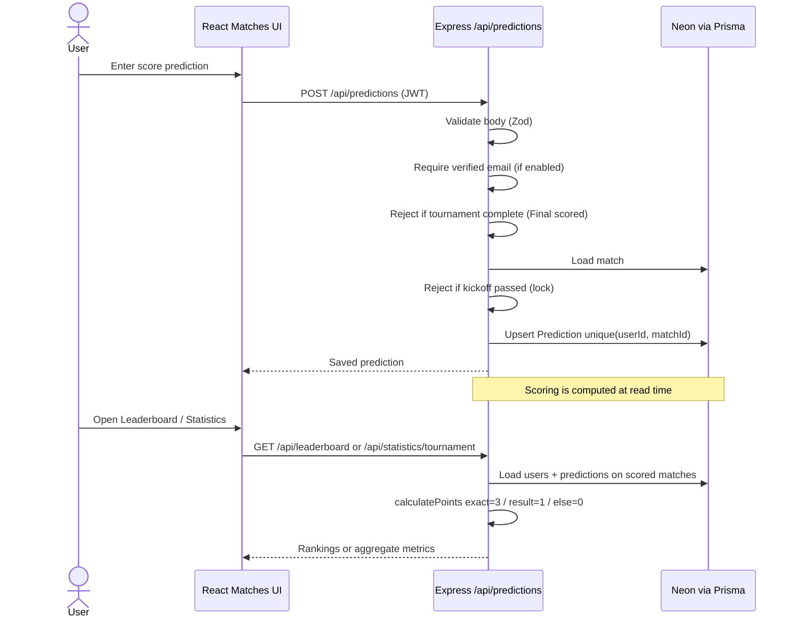
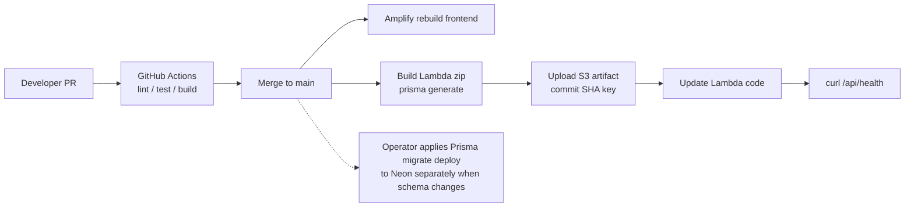

# Architecture

PitchPulse 26 is a serverless full-stack application: a React SPA on AWS Amplify talking to an Express API on AWS Lambda (HTTP API Gateway), with Neon PostgreSQL via Prisma and Resend for transactional email.

## High-level system architecture

### Component notes

| Component | Role in this repo |
|-----------|-------------------|
| `client/` | React + TypeScript UI, React Router, Tailwind, service worker in production |
| `server/src/index.js` | Express app: auth, matches, predictions, leaderboard, groups, admin, reminders, statistics |
| Prisma | Schema + migrations under `server/prisma/`; Neon adapter for serverless |
| Amplify | Hosts the frontend build from `main` |
| Lambda + API Gateway | Hosts `/api/*` |
| Resend | Verification, password reset, historical match-reminder emails |
| Terraform `infra/` | Lambda, API Gateway, Amplify app, monitoring, SSM, SES domain identity (email sending moved to Resend in application code) |

Services **not** used as primary runtime today: container orchestration, Redis, dedicated chart SaaS, native mobile apps.

## Prediction submission and scoring flow

Admin flow: authenticated admin calls `PATCH /api/admin/matches/:id/result`, which updates scores, writes `AdminAuditLog`, and causes subsequent leaderboard/statistics reads to reflect new points.

## Deployment flow (GitHub → AWS)

**Code deployment does not automatically guarantee database schema compatibility.**

## Key runtime behaviors

- **Tournament complete:** Final match has both scores → prediction writes `403`; archive UX on the client.
- **Statistics:** `GET /api/statistics/tournament` aggregates participation, outcomes, standings highlights, Final result — read-only.
- **Reminders:** `POST /api/reminders/run-next-day` remains secret-protected; GitHub cron schedule is disabled post-tournament.
